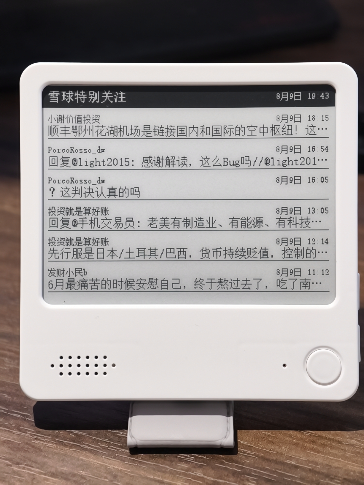

# xueqiu-watch-v2

把你在雪球**特别关注**的用户帖子，定时抓下来、渲染成 **400×300 1-bit 墨水屏图**，推送到
**极趣云（Zectrix）墨水屏**，并可同时推到**手机**（企业微信 / Bark / 自建 APP）。

这是一个**独立运行的后端服务**，部署在 NAS / 树莓派 / 任何能跑 Python 的设备上，
不依赖电脑常开、不依赖浏览器在线。



> 配套文档见 [FEATURES.md](FEATURES.md)（功能说明）、
> [RELEASE_NOTES.md](RELEASE_NOTES.md)（版本记录）、[DEBUG_LOG.md](DEBUG_LOG.md)（踩坑与调试记录）。
> 端到端流程图见 [docs/architecture.svg](docs/architecture.svg)。

---

## 0. 个人自用最简部署（推荐先看这段）

你只想自己用：屏幕蹦你特别关注的新帖 + 手机收通知。**不需要公网、不需要 Docker、不需要写 APP。**

1. NAS 上把本仓库放到 `/share/nas02/xueqiu-watch-v2`，`pip3 install -r requirements.txt`。
2. 复制 `config.example.json` 为 `config.json`，填 `zectrix.api_key` / `device_mac` / `followed_user_ids`
   （直接填雪球**昵称**也行，后端会用你的 cookie 自动解析成数字 id）。
3. QTS「任务排程」加一条**开机执行**脚本，内容即本仓库的 `start-xueqiu.sh`
   （它用 `setsid` 拉起 `main.py`，并做防重判断——QTS 的 BusyBox 没有 `nohup`/`pgrep`，必须用 `setsid`）。
4. 浏览器打开「Cookie 管家」扩展，填 `http://<NAS内网IP>:8899`，勾雪球 → 读取 → 导出到 NAS。看到 `{"ok":true}` 即成。
5. 手机：在 `config.json` 的 `phone` 段启用 `wecom`（企业微信机器人 webhook，安卓/iOS 通用）或 `bark`（仅 iOS），
   填好 webhook、把 `enabled` 改成 `true`，重启后端即生效。**无需公网、无需 cloudflared。**

> 雪球 cookie 几周过期一次，届时回浏览器重导一下即可，后端不用动。
> 想从外面访问（出门也能看）才需要 cloudflared / WireGuard，个人家用可跳过。

---

## 1. 架构

```
浏览器「Cookie 管家」扩展  ──HTTP POST /api/set-cookies──▶  NAS 上的 雪哨 v2 后端
        （你点一次“导出到 NAS”）                              │
                                                              │ 定时轮询雪球 API
                                                              ▼
                                                  渲染 400×300 1-bit 图
                                                              │
                                    ┌─────────────────────────┴──────────────────┐
                                    ▼                                            ▼
                          墨水屏 Sink（Zectrix 云 API）              手机 Sink（企业微信/Bark/自定义）
```

文件说明：

| 文件 | 作用 |
|------|------|
| `main.py` | **单进程入口**：后台起 Cookie 接收服务 + 主线程 `while True` 轮询推送 |
| `config.py` | 配置加载（`config.json`，敏感字段可被环境变量覆盖） |
| `cookies_store.py` | 多站 Cookie 加密存储（`cryptography.Fernet`，缺失则降级 base64 混淆） |
| `xueqiu.py` | 雪球 timeline 抓取与归一化（自动绕开阿里云 WAF） |
| `eink.py` | 帖子渲染成墨水屏图 + 推送到 Zectrix（Open API） |
| `bitmapfont.py` | **纯 Python 1-bit 点阵渲染引擎**（零第三方依赖，见下方说明） |
| `server.py` | Cookie 接收 + 帖子只读 HTTP 服务（标准库，零依赖） |
| `tools/gen_songs_fonts.py` | 点阵字库生成器（需 Pillow，在本地电脑跑，输出 `.xwbf`） |
| `start-xueqiu.sh` | 一键启动脚本（QTS 任务排程调用） |
| `deploy_push.py` | 开发/运维用：把本地改动同步到 NAS 运行目录（**凭据从环境变量读，禁止硬编码**） |

### 为什么不用 Pillow 直接渲染？

QNAP TS-231P 是 **ARMv7 + Python 3.12**，PyPI 无预编译 Pillow wheel，机器上也没有 `gcc` 装不上。
因此 V2 用**纯 Python 点阵字库（`.xwbf`）+ 手写 PNG 编码器**：字库在本地有 Pillow 的电脑上一次性烤好，
NAS 端只做"取字模 → 画点 → 编码 PNG"，完全不需要 Pillow。好处是**本机与 NAS 出图逐像素一致**。

---

## 2. 在 QNAP TS-231P 上部署

> TS-231P 是 ARM 架构、1GB 内存、不带 Docker。下面走「纯 Python」路线，不需要 Container Station。

### 2.1 准备运行环境（一次性）

1. **开启 SSH**：QTS 控制台 → 网络与文件服务 → Telnet / SSH → 启用 SSH。
2. **装 Python 3.12**：App Center 搜索并安装官方 **Python 3.12**（路径形如
   `/share/CACHEDEV1_DATA/.qpkg/Python3/opt/python3/bin/python3.12`）。
3. **装 Git**（二选一）：App Center 搜 **Git** 安装；或 Entware `opkg install git`。
   若都不方便，可跳过 Git，直接把本文件夹用 File Station 上传到 NAS。

### 2.2 获取代码并安装依赖

```bash
cd /share/nas02
git clone <你的仓库地址> xueqiu-watch-v2
cd xueqiu-watch-v2
pip3 install -r requirements.txt
```

> 若 `pip3` 报权限问题加 `--user`。TS-231P 性能有限，Pillow 安装可能要等几分钟。

### 2.3 写配置文件

```bash
cp config.example.json config.json
vi config.json
```

必填：
- `zectrix.api_key`：极趣云 Open API Key（控制台获取，形如 `zt_xxx`）。
- `zectrix.device_mac`：墨水屏 MAC（设备背面 / 极趣云后台查看）。
- `zectrix.page_id`：推到第几页（1–5，默认 1）。
- `followed_user_ids`：特别关注用户，填 `["__auto__"]` 自动拉取「特别关注」分组（推荐）。

可选：
- `poll_interval_minutes`：轮询间隔，默认 **10**（分钟）。
- `digest_count`：墨水屏展示条数，默认 **6**（受 300px 高度限制，实际显示 6 条）。
- `server_port`：**接收服务端口，默认 8899**（8080 被 QTS 占用，千万别填 8080）。
- `cookie_import_file`：浏览器快捷写入目录经同步落盘的路径（与 HTTP 推送二选一或并存）。
- `phone`：手机推送配置（见第 4 节）。

> 敏感字段也可走环境变量：`export ZECTRIX_API_KEY=zt_xxx`、`export ZECTRIX_DEVICE_MAC=AA:BB:CC:DD:EE:FF`。

### 2.4 开机自启（关键）

QNAP 没有 systemd，用 **Task Scheduler** 做开机拉起（注意用 `setsid` 而非 `nohup`）：

1. QTS 控制台 → 控制台 → 任务排程 → 新增 → **用户自定义脚本（启动）**。
2. 用户选 `admin`，触发选 **开机**。
3. 脚本内容（`start-xueqiu.sh` 已封装好，直接调用）：

```bash
sh /share/nas02/xueqiu-watch-v2/start-xueqiu.sh
```

保存后手动「执行一次」验证，或重启 NAS 验证自启。日志看 `xw.log`。

> 可选保活：计划任务里加一个每 10 分钟检测进程不在就拉起的脚本，更稳。

---

## 3. 浏览器端：导出 Cookie 到 NAS

1. 安装「**Cookie 管家**」扩展（多站版）。
2. 弹出界面里填 **NAS 地址**：`http://<NAS局域网IP>:8899`（与 `server_port` 一致）。
3. 勾选「雪球」，点 **读取已勾选站点 Cookie** → 再点 **导出到 NAS**。
4. 看到 `{"ok":true,"sites":["xueqiu"]}` 即成功。

此后后端自动用这个 cookie 轮询雪球。**雪球 cookie 通常几周过期**，过期后前端抓不到帖子、
墨水屏会停在「暂无新帖子」。届时重做第 3 步即可，无需动后端。

> **防火墙提醒**：QNAP 防火墙需放行 8899 入站（仅限局域网）。**不要把这个端口直接暴露到公网**——
> `POST /api/set-cookies` 已做来源限制（仅内网/回环可写）。

### 3.1 远程访问（出门也能用）：Cloudflare Tunnel（可选）

`cloudflared-config.yml`（仓库已附）只允许 `/api/posts` 与 `/api/health` 走隧道，`set-cookies` 永远留内网。

```bash
/share/Public/cloudflared-linux-arm tunnel --config cloudflared-config.yml run xueqiu-watch
```

得到 `https://xxxx.trycloudflare.com`，手机 APP 的 Base URL 就填它。**不想用 Cloudflare** 也可手机装
WireGuard 回家（VPN），直接用局域网 IP 访问，数据全程不出家门网络。

---

## 4. 手机推送（Sink）

`config.json` 的 `phone` 段：

```json
"phone": { "enabled": true, "type": "wecom", "webhook": "https://qyapi.weixin.qq.com/cgi-bin/webhook/send?key=xxxx" }
```

- `type=wecom`：企业微信群机器人 webhook（群 → 右上角「…」→ 添加群机器人 → 复制 webhook）。
- `type=bark`：iOS Bark APP 推送地址，形如 `https://api.day.app/你的KEY/`。
- `type=http`：**自定义安卓 APP / 自建服务**：后端把原始帖子 JSON `{"posts":[...]}` POST 到 webhook。
- 手机推送默认**只推新帖**（按 id 去重，跨重启持久化在 `state.json`）。

---

## 5. 常见问题

- **墨水屏不更新 / 显示"暂无新帖子"**：九成是雪球 cookie 过期 → 重导（第 3 节）。
- **中文乱码/方块**：NAS 缺 CJK 字体 → 在 `config.json` 设 `font_path` 指向中文字体（或使用已生成的 `.xwbf` 点阵字库，无需系统字体）。
- **8899 连不上**：检查 NAS 防火墙、确认后端进程在跑（`ps | grep '[m]ain.py'`）、`xw.log` 有无报错。
- **cryptography 装不上**：代码自动降级为 base64 混淆并打警告，功能不受影响，只是 cookie 存储安全性较弱。
- **推到设备后一段时间被别的卡片刷掉**：在 Zectrix 小程序把墨卡里的「心灵鸡汤」等模板卡删掉，设默认主页/待机=墨卡。
- **设备刷新频率 vs 推送频率**：推送端固定每 10 分钟生成新图；设备端刷新频率建议在小程序里也设为 ~10 分钟，避免反复刷同一张旧图加速屏老化。

---

## 6. 开发：重新生成点阵字库

字库是 **GBK 全字符集**，体积较大（每档 ~600KB–4MB），已生成好的宋体三档 `fonts/font12/16/18.xwbf`
直接随仓库发布，一般无需重生成。若改字体/字号，在**本地有 Pillow 的电脑**上：

```bash
python tools/gen_songs_fonts.py            # 生成全部内置字体（song/fang/kai/deng/hira）
python tools/gen_songs_fonts.py fang kai  # 只生成指定字体
```

生成器支持多款字体（`tools/gen_songs_fonts.py` 里的 `FONTS` 字典）：`song` 宋体（默认）、
`fang` 仿宋、`kai` 楷体、`deng` 等线-细、`hira` Hiragino Sans GB W3。切换显示字体在 `eink.py`
的 `render_digest(..., font_tag='')` 参数，对应字库 `fonts/font{size}_{tag}.xwbf`。
